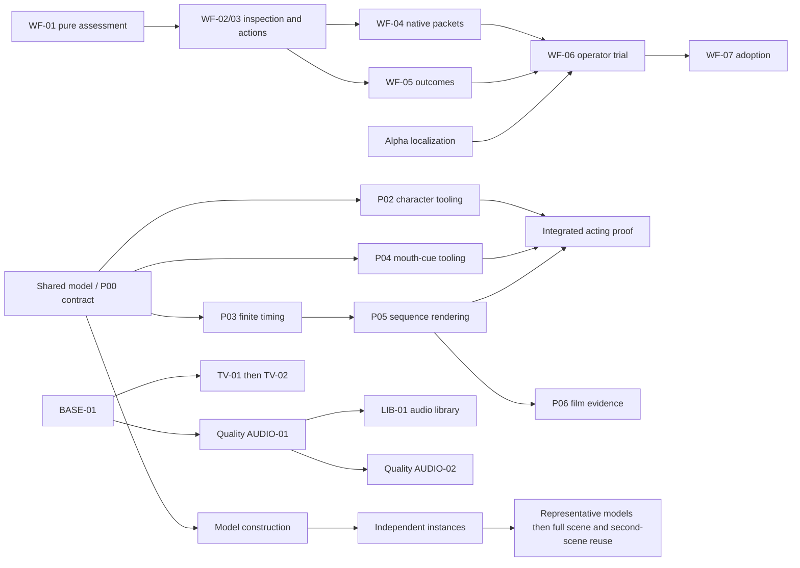

# Coordinated implementation restart

September 13, 2026 UTC / September 12 EDT. Coordinator: Codex task `01a0983d-40cf-71a3-bd9c-cb8308ad6efa`, branch `codex/coordinated-studio-restart`. Inspected implementation baseline: `00c64436543d0252fc0850f3ef58e686badda1b6` (`origin/main`). The user authorized starting ready workstreams and coordinating them. This is a dispatch and integration record; the existing owning backlogs retain capability and acceptance status.

## Assessment

The [alignment plan](STUDIO-PLAN-ALIGNMENT.md) is cohesive: canonical scope and evidence, editable models, agent guidance, narrative timing and audio reuse have distinct owners and share explicit interfaces. Its principal delivery risk is allowing the planned systems to independently redefine identity, coordinates, time or evidence. The right first wave combines one short shared-contract task with independent implementation, then starts consumers from the integrated contract.

The September 12 extraction work has landed. Current command adapters and explicit `--out` ownership, render planning/execution/native services, revision services, coverage context/evidence/records and iteration services provide useful boundaries. Do not repeat those refactors or use ownership tables written against their earlier monoliths.

| Area | Implementation observed at baseline | Remaining work and consequence |
| --- | --- | --- |
| Canonical production foundation | Typed plan, inventory, source preparation/placement, tracks/sockets/bindings, views, revisions, editions, resumable runs, exact delivery and cue checks exist. The production backlog already marks most foundation work implemented. | Preserve those statuses. Artistic/operator trials and full-scene acceptance remain open; neither a code merge nor a fixture passes them. |
| Workflow | `production_coverage.evaluate()` ends by calling `coverage_records.save_report()`. `production_queries.next_work()` emits generic routes and its callers leave dependency arrays empty. Extracted `coverage_context.py` still resolves full scene/catalog/runtime state. | WF-01 must make genuine pure, scoped assessment possible before WF-02/03 stage guidance. Extracted code ownership alone did not ship guidance. |
| Reusable models | Compiler registration, flat scene layers, sockets, binding and look-package reuse exist. `assets.py` searches prepared raster catalogs/reference studies. No native reusable model/instance operation is advertised. | Resolve one model/character definition and version contract, then implement independent construction and instances. Raster admission and flat separation cannot substitute for editable nested models. |
| Narrative | `editor/engine.mjs` wraps every sample to `canvas.loop_seconds`; track validation requires loop endpoints and closure/hidden-reset. `editor/timing.mjs` reports that evaluator's clock. | P03 needs an explicit finite clock and shared conversion rules. P02/P04 must consume the same identity/time contracts; P05/P06 follow real integrated outputs. |
| Audio | `audio.py` handles identified project-contained integer PCM WAV, arrangement, comparison and cue checks. Doctor reports normalization/true peak unsupported. | Quality-plan AUDIO-01 precedes LIB-01. Preserve originals and explicit rate conversion; use a typed audio library rather than extending the visual raster schema. This is distinct from production-plan AUDIO-01, which is already implemented cue alignment. |
| Visual diagnostics and quality | `auditViewPixels()` checks actual pre-background alpha at reduced resolution and returns counts/worst frame. Existing render benchmark uses the actual stage plan and optional native sample. | Add exact defect localization to the existing proof output. Existing benchmark measurements do not justify a renderer rewrite. TV profile/source-detail work follows BASE-01, and renderer-limit changes remain conditional. |

The local doctor reports Python 3.14, Node 24.9, Pillow and Node Canvas 0.1.100, plus available macOS native media capability. FFmpeg and FFprobe are absent. Availability is not encode/decode success. Full baseline test evidence is recorded in the companion dispatch ledger after completion.

Project discovery found available Amberwatch at `/Users/lb/.codex/worktrees/e31d/ambiance-studio/projects/amberwatch`, Last Lantern at `/Users/lb/Developer/ambiance-studio/projects/last-lantern`, and The Midnight Collection at `/Users/lb/Developer/ambiance-studio/projects/the-midnight-collection`. Registered `a-quieter-tomorrow-fresh` and `midnight-reading-room` paths are unavailable. These are read-only source/evidence candidates, not a newly selected production film. The existing task “Start seed image film” was idle at inspection; no competing engineering task was active.

The first-wave audio owner has supplied a source-bound candidate inventory (path/hash in the ledger), including retained compressed originals. It has also exercised installed `afinfo`/`afconvert` for local decoding and 44.1-to-48 kHz conversion. This supports continuing local preparation without tool installation or new generation. Audition, derivative acceptance and the implemented preparation contract remain separate work.

## First dispatch wave

Four workers start in isolated project worktrees from the merged main baseline. The coordinator remains in this task. Each first assignment is bounded; subsequent work is explicitly continued after its dependency is reviewed and integrated.

| Stream | First assignment | Exclusive implementation ownership | Required first handoff | Next continuation |
| --- | --- | --- | --- | --- |
| W — workflow guidance | **WF-01 only:** separate assessment from persistence, preserving public coverage behavior. | `production_coverage.py`, `coverage_context.py`, `coverage_records.py`; narrow assessment call sites in `production.py`, `production_queries.py`, `iteration_plan.py`; focused coverage tests. | Pure reads with no project writes/lock; partial diagnostics, selected-versus-working identity, compatibility tests and public CLI replay. | WF-02/03, then separately WF-04 and WF-05; WF-06/07 only after observed replay. |
| M — model/character contract | **Model Phase 1 / P00 shared technical subset:** reconcile contracts against current code; publish versioned interface specimens and the smallest construction/instance slices. | New contract documents and fixtures; narrow additions to the model plan/P00 interface material. No production runtime or canonical film edits in the first assignment. | Stable IDs, nested version pins, coordinate/clock APIs, ownership versus mounting/order/light, proof dependency identities; lantern, registered character and unequal-shot/cue specimens; explicit unresolved artistic/film inputs. | Model Phase 2 construction, then Phase 3 instances. P02 character specialization and P03 finite timing can start against the integrated contract without waiting for the complete model library. |
| S — audio reuse foundation | **BASE-01 read-only inventory, then quality AUDIO-01:** inspect available sources/runtime and implement explicit local source preparation. | New audio-source/preparation modules and focused tests; narrow `audio.py` parser/service integration. Coordinate any native/revision/diagnostic hook before editing. | Actual source inventory with hashes/format/availability and unknown auditions; original-preserving local preparation receipt, tested decoder/resampler, failure cases and public CLI replay. | Quality AUDIO-02 and typed LIB-01 can branch after AUDIO-01; collection curation and mixes require their actual prerequisites. |
| D — raster defect localization | **Amberwatch audit's alpha localization follow-up:** extend current paired proof diagnostics. | `editor/audit.mjs`, focused alpha helper if justified, `tools/render/outputs.mjs`, `tools/views-proof.mjs`, relevant raster/proof tests. | Exact failing-frame image and alpha heatmap, bounded coordinates/bounds, threshold/resolution/renderer/view/time identity; interior-hole and boundary-filtering cases; actual browser proof inspection. | Supplied-art regression/operator trials; TV-01/02 after BASE-01 and an explicit shared-file lease. |

W owns assessment; D owns raster measurement. Neither invents artistic acceptance. M designs the common graph; later P02 extends it for characters rather than inventing another graph. S owns audio source meaning; model definitions do not absorb audio catalog records.

## Dependency order and later parallelism

The arrows describe technical joins, not the entire artistic dependency graph. Original `start_after` and `accept_after` distinctions remain authoritative. P04/P06 may develop against fixed specimens but cannot be accepted without real P02/P03 and P05 integrations respectively. P01 story can start independently once the example film's actual creative brief and canonical project are resolved. P07–P14 art, voices, acting, shot batches and finishing are not dispatched merely because engineering started.

Maintain about four active workers initially; this is a coordination choice, not a measured hardware capacity claim. As M's first packet finishes, continue its construction owner and use the next free slot for finite timing. Workflow packets/outcomes can split only after WF-03 and a split of shared operations ownership. Avoid simultaneous full native-media suites when bounded tests suffice.

## Integration and unblocking

The coordinator owns the central `cli.py` / `command_output.py` hooks, `tools/scene-command.mjs`, shared media job/receipt registration, test-suite/package-audit registration, the public capability index and CLI reference, authoritative backlog status and this dispatch ledger. Workers propose small hook patches early; the coordinator can explicitly lease a narrow hook so CLI validation is never postponed to the final handoff. No broad shared refactors.

Every worker reports its actual task ID/worktree/base, owned paths, early interface decision, exact commit(s), public replay argv, test results/skips, artifact paths/hashes and residual acceptance gaps. A blocked worker identifies the failing command or missing contract and continues independent work. The coordinator supplies the interface or baseline, resolves integration conflicts, returns failures to the responsible owner and resumes related work in its existing task when practical. No busy-polling tasks.

Integrate dependency order into a coordinator branch, review the combined diff, and run affected checks plus `./ambiance test` and the package audit. Browser/raster/native behavior requires corresponding actual evidence; an isolated green test run does not certify the combined result. First tasks should return committed, reviewable local changes; this kickoff does not direct autonomous main merges or external publication. Preserve existing film state and accepted versions. Media workers use exclusive candidate directories and immutable source copies, not dependencies on another disposable worktree.

All four workers confirmed their exact base and active tasks through messages and `wait_threads`. The app's `list_threads` currently omits them; use the verified IDs in the ledger, never create duplicate replacements. A 15-minute heartbeat named “Coordinate studio implementation” manages these initial assignments through local integration, combined validation and a next-wave readiness report. It stays quiet on unchanged state and pauses when that bounded coordination is complete.

Task IDs, current handoffs and coordinator follow-up are recorded in [the dispatch ledger](COORDINATED-IMPLEMENTATION-2026-09-13.json). This ledger tracks coordination only. Canonical task status remains in [workflow YAML](WORKFLOW-CLI.yaml), [the model plan](REUSABLE-MODEL-SCENES-PLAN.md), [first-short JSON](FIRST-SHORT-WORK-PACKAGES.json), and [quality YAML](TV-QUALITY-AND-SOUND-LIBRARY.yaml). Preserve the qualified foundation statuses and do not infer gate passage, a human audition, or full-film completion.
