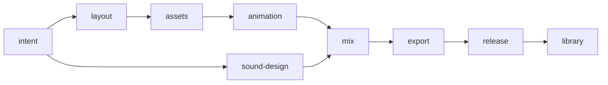

# Workflow guidance in the Ambiance CLI

Proposed September 12, 2026. This is a design for implementation, not a description of shipped commands. The user requested a plan and design; this change does not implement the feature or alter any project's requirements. The [implementation backlog](WORKFLOW-CLI.yaml) owns task status, dependencies and acceptance criteria.

## Recommendation

Make the CLI the primary guide for operating a film project. It should explain the current expectations, resolve the inputs for a bounded action, describe its outputs, and give the appropriate continuation or repair after execution. Keep skills for artistic methods, examples and judgment that cannot be established by a validator.

Build on the existing pipeline, plan, evidence and iteration services. Add one `workflow` command group for understanding and preparing work, enrich `project next`, and add optional contextual guidance to production command responses. Production operations continue through their existing commands. There is no new scheduler, general script engine or manually advanced stage cursor.

The first useful release is inspection and next-work guidance. Input packets and command-result guidance follow as separately testable increments. A custom workflow editor and a browser stage board are later possibilities, contingent on the CLI pilot.

## Existing foundation and observed gaps

The following was checked against the current checkout, including a disposable blank-project CLI invocation. This is the baseline for the proposal.

| Existing owner | Reuse | Gap to address |
| --- | --- | --- |
| [`studio.py`](../../studio.py), project `pipeline.json` | Nine default gates, ordered dependencies, criterion descriptions and observer kinds, evidence and freshness validation | A gate graph specifies when reviews can pass; it does not fully specify which production operations can proceed |
| [`production_plan.py`](../../ambiance_studio/production_plan.py), [`production_coverage.py`](../../ambiance_studio/production_coverage.py) | Canonical creative scope, exact expectations, structural/measured/observed evidence, view and revision identities | Coverage stages are only `layout`, `assets`, `animation`, `export`; they are not interchangeable with all nine gates |
| [`planning.py`](../../ambiance_studio/planning.py) | Inventory parts, fulfillment and work dependencies | `next_action` is authored prose, so there may be no concrete operation or input contract |
| [`production_queries.py`](../../ambiance_studio/production_queries.py) | Bounded summaries and `project next` aggregation | Ready inventory rows commonly point back to `plan next`; observation rows are generic; dependency arrays are currently left empty by callers |
| [`production.py`](../../ambiance_studio/production.py), revisions, deliveries, feedback and run control | Resumable iterations, exact movies, scoped feedback, selected review/release and interrupted work | Overview combines working production with reviews of the selected movie; a suggested action needs an explicit subject |
| Existing `review draft`, preparation initializers, `iteration init`, `review packet init` | Validated native input construction and unperformed review drafts | The operator still has to discover the applicable initializer and connect its inputs and outputs |

On the blank fixture, `project next` surfaced a missing-plan coverage action at the default animation stage and generic pending/blocked observations. The initial useful action should instead explain how to inspect the reference and author intent, including the fields that require a creative decision.

There is also a concrete query-side effect: `production_coverage.evaluate()` saves `.ambiance/coverage/<hash>.json`. Consequently, calls that use it for overview are not fully read-only. Separate computation and persistence before building workflow inspection on it. Keep the existing explicit coverage command's saved-report behavior compatible.

## Ownership and saved state

Use the following boundaries. Workflow guidance references the owners; it does not copy their editable state into another project plan.

| Information | Authority |
| --- | --- |
| Requested creative scope, actions, intended views/roles and expectations | Canonical production plan; explicit compatibility handling for unmigrated projects |
| Parts, produced artifacts and fulfillment | Inventory, catalog and scene |
| Gate criteria, observer requirements and gate dependency order | The selected working or captured pipeline |
| Observations and current review verdicts | Existing review/feedback receipts for the exact subject |
| Execution progress and completed steps | Existing iteration/run records |
| Selected movie and release eligibility | Existing delivery selection and review services |
| Purpose, useful input/output descriptions, operation bindings and repair hints | A bundled, versioned workflow guidance catalog |

The proposed catalog is `templates/workflows/painted-film.v1.json`. It contains stage descriptions, links to authoritative references, known criterion IDs, operation IDs and named resolver bindings. Python services implement the bindings. It contains no shell strings, arbitrary predicates, executable expressions, provider requests or duplicated quality thresholds.

Do not add guidance fields to existing pipeline gate objects: the gate digest covers the entire object, so editorial guidance changes would unnecessarily stale reviews. Responses identify the catalog version and content hash. Saved input packets retain the relevant catalog snapshot/hash for reproducibility. A compatible guidance update can improve current instructions without rewriting project state or changing a captured verdict.

The first release needs no project-level workflow configuration, adoption ceremony or persisted `current_stage`. It reads the project's existing pipeline. Unknown custom gates receive their actual criteria and dependencies plus generic review guidance. Missing catalog bindings are reported as limitations; they cannot remove or silently replace custom criteria. Known gates with altered criteria use those actual criteria and suppress any incompatible completion binding. Broader custom workflow authoring is outside this proposal.

## State model: work and review are different dimensions

The review graph remains:



These arrows are dependencies for passing gates. They are not blanket prohibitions on production. A cutout proof can be built before layout is reviewed if its actual source and recipe are usable. Sound sources can be prepared alongside picture work. A handoff or review movie can be prepared while final human observations remain open.

Each stage projection reports three separate dimensions:

| Field | Values and meaning |
| --- | --- |
| `work.state` | `actionable`, `needs-input`, `needs-observation`, `blocked`, `none`, `unknown`; derived from relevant candidate operations and unresolved decisions. `none` means no identified applicable work, not stage completion |
| `gate.state` | Unchanged existing `pending`, `blocked`, `revise`, `stale`, `passed`; with criterion and dependency references |
| `coverage` | Existing stage-specific result with its scope, or explicitly `unsupported`, `legacy`, `unavailable` or `not-evaluated`; never an invented pass |

Operation prerequisites concern its real inputs and runtime. Gate dependencies concern acceptance. Report both, without copying every unpassed gate into every operation's blocking dependencies. An absent proof is work to perform; an unobserved proof is an observation to make; neither is automatically a request to the user. Only actual human criteria are labeled as requiring a human observer.

Prefer `actionable` when at least one independent operation or sufficiently specified creative decision can proceed; otherwise expose the most immediate unmet prerequisite and the underlying candidate states. Existing feedback can satisfy an observation when it actually addresses the criterion for the identified artifact. Do not request an already recorded observation again merely because the guidance feature is new.

Full-scope coverage and final/release constraints remain enforced at the existing operation boundaries. Guidance cannot waive them. A focused stage/view query changes the inspection scope, not the saved production scope. Partial proofs and review renders remain explicitly partial.

## Command surface

All commands below are proposed. Use the existing global `--project`/`--registry` selection and JSON envelope.

| Command | Result and side effects |
| --- | --- |
| `workflow inspect [SUBJECT] [--details] [--out FILE]` | Read-only stage graph, selected subject, work/review states, bounded next actions and independent work; only explicit `--out` saves a report |
| `workflow stage STAGE [SUBJECT] [--details] [--out FILE]` | Stage purpose, resolved inputs, expectations, outputs, operation candidates, outstanding observations and repair paths |
| `project next --guided [SUBJECT] [--stage STAGE] [--limit N --offset N --kind KIND]` | The shared action projection, filtered and ordered; existing unflagged behavior stays available during rollout |
| `workflow explain ACTION_ID [SUBJECT]` | Resolve one action's reasons, evidence, prerequisites, input fields, output contract and continuation; a no-longer-applicable ID returns an explicit stale-action error |
| `workflow prepare ACTION_ID [SUBJECT] --out DIR [--inputs FILE] [--expect-assessment HASH]` | Create a fresh input packet using supported initializers; never execute the production action |

`STAGE` resolves against the selected project's actual pipeline, including custom IDs. New workflow commands are guided by definition. `project next --guided` avoids silently changing the current next-work schema and subject selection. After a measured pilot, making guided next-work the default is a separate compatibility decision.

`SUBJECT` is one of the following selectors:

- No selector, or `--subject working`: current working inputs and working reviews.
- `--subject review` or `--subject release`: resolve that selection once, then assess its exact delivery entries. Never silently fall back to working state when a selection is missing.
- `--revision ID`, optionally `--edition ID`: captured production or a specific captured edition; mutually exclusive with `--subject`.

An optional `--view ID` narrows within that subject. Without it, assess all intended views and roles applicable to the working plan or all selected delivery entries. Multiple entry results retain individual identities and do not inherit the default entry's verdict. Invalid or conflicting selectors fail. Responses disclose `full_scope` and the included output pairs. A delivery can include more than one revision; do not force all entries into a single revision context.

Default workflow inspection is about working production. It also includes compact pointers to the selected review/release and any divergence, clearly separated. Historical feedback remains visible with its original subject; applying it to a new working revision is an explicit operator disposition.

## Stage expectations

The catalog supplies practical guidance for every existing stage. Criteria are loaded from the selected pipeline; the outcome column below describes useful work and does not add new acceptance requirements.

| Stage | Useful output | Primary continuation or repair |
| --- | --- | --- |
| Intent | Inspected reference, brief, explicit creative scope and unresolved decisions | Author the missing story/view/action decisions; retain known direction rather than asking again |
| Layout | Whole-scene plan, independent objects/backing, attachments and requested composition proofs | Repair framing or hidden-art requirements before expensive finishing |
| Assets | Source-preserving prepared packs, registrations, edge/isolation proofs and provenance | Fix the responsible preparation/registration or missing backing; derive a new version |
| Animation | Assembled motion, actual timing, view-bound activity/proof evidence and observations | Repair art, rig, clock or view at the responsible source; repeat affected checks |
| Sound design | Selected sources, source records and real auditions supporting the brief | Reuse/reselect or edit the source responsible for a defect; unknown audition stays unknown |
| Mix | Circular arrangement, masters/stems, numerical checks and repeat listening | Correct cue, source or mix; reassess picture-linked timing when it changed |
| Export | Captured editions and complete decode evidence for requested view/role pairs | Reuse verified picture/steps where valid; repair or resume only affected jobs |
| Release | Exact movies presented with applicable human observations and open criteria | Incorporate feedback or retain unperformed checks while continuing eligible work |
| Library | Rebuild records, selected reusable modules and exact handoff | Complete missing provenance/links; historical and working versions stay distinguishable |

For a fresh project, begin with available source and intent material. Missing canonical intent is not an excuse to dump downstream animation failures into the first response. For an existing legacy project, display the original requirements, inventory completeness and migration limitations. Missing canonical-plan support must not imply an obligation to expand previously explicit scope.

## Action contract and recommendation ordering

One shared action projection feeds workflow commands, guided `project next`, and eventually Studio. An action has:

- A stable ID derived from its origin issue, logical subject and operation; a separate assessment hash binds the actual input identities.
- `stage`, existing next-work `kind`, exact `subject`, `reason`, underlying `issue_ids` and criterion/expectation references.
- `state`: `ready`, `needs-input`, `needs-observation`, `blocked` or `unavailable`.
- Actual prerequisite action IDs in `dependencies`, gate-passage dependencies separately, and `blocked_by` references with concrete reasons.
- Resolved input references, unresolved fields, expected outputs and effects (`read`, `artifact-write`, `project-write`).
- Executable `argv` and `cwd` only when all required arguments resolve. Otherwise an input/decision description and a usable explain/prepare route.
- Completion evidence, scope limitations, and success/failure continuation descriptions that are re-resolved after the operation.

For working production, an action's logical subject uses stable asset/action/expectation IDs so ordinary edits do not rename the work item. For captured media, its key includes the resolved revision/edition/movie identity, rather than the moving word `review`. The assessment hash covers the resolved query scope, relevant input fingerprints, evaluator version and catalog hash. It is a freshness token, not a review receipt or authority record. Partial assessments explicitly state their missing components.

Retain compatible `id`, `kind`, `subject`, `reason`, `dependencies`, `argv` and `decision` fields where their meanings apply; guided results have their own `format` and `schema_version`. All IDs, hashes and paths are complete. Resolved command vectors use the absolute launcher and absolute CLI input/output arguments; saved manifests keep the existing project-relative reference conventions. A runnable command never contains a placeholder such as `YOUR_FILE`.

The ordering is dependency-aware and deterministic:

1. Unusable/changed inputs that prevent assessment or execution, plus recoverable interrupted work relevant to the selected subject.
2. Applicable open feedback requiring a disposition or repair.
3. Missing early intent and prerequisite production work for required expectations, before symptoms they explain downstream.
4. Ready production, proofs and observations, grouped so the action that unblocks several items appears once.
5. Remaining observations and unavailable work, with independent actions still visible.

User-supplied stage/view filters focus this order without hiding required prerequisites; external prerequisites are included as references with an explanation. Unknown cause yields a diagnostic action, not a confidently prescribed repair. Do not infer causality by matching prose. Map structured evaluator IDs and error codes through tested adapters, and retain unmapped findings visibly.

Recommendation order does not execute anything, grant authority, select a generation provider or change scope. An operation still performs its normal validation at invocation. A generated output path is only a proposal until created; a concurrent collision must fail safely.

## Example: a pack needs a registration proof

Illustrative excerpt of a proposed guided action, not an existing project or a tool result:

```json
{
  "id": "assets.pack.ghost-v2.registration-proof",
  "stage": "assets",
  "kind": "production",
  "state": "ready",
  "subject": {
    "mode": "working",
    "asset_id": "ghost-v2",
    "pack_path": "assets/compiled/ghost-v2"
  },
  "reason": "The compiled pack is intact; its cel registration has no current playback proof.",
  "dependencies": [],
  "blocked_by": [],
  "criteria": [{"gate": "assets", "id": "registration"}],
  "effects": ["artifact-write"],
  "cwd": "/workspace/ambiance-studio",
  "argv": [
    "/workspace/ambiance-studio/ambiance", "--project", "/workspace/film",
    "asset", "proof", "/workspace/film/assets/compiled/ghost-v2",
    "--out", "/workspace/film/reports/assets/ghost-v2-proof-01"
  ],
  "expected_outputs": [
    {"kind": "asset-proof", "path": "reports/assets/ghost-v2-proof-01", "state": "proposed"}
  ],
  "completion": {
    "operation": "Proof artifacts exist and match the inspected pack.",
    "observation": "Watch the complete cel sequence for pivot/scale drift and closing continuity."
  },
  "on_failure": {
    "unmapped_error": "Preserve the original error and inspect the pack; do not regenerate a source automatically."
  }
}
```

The full response also carries the assessment/catalog identity and verified input references. Building the proof fulfills that operation, not the observation or the complete assets gate. If layout acceptance remains pending, it is reported as a gate dependency without preventing this otherwise usable proof operation.

## Inputs: prepare reviewable, native work packets

`workflow prepare` is a small adapter over native initializers and validators. It creates a new directory with `packet.json`, any native input/draft files, and a short `README.md` explaining the work and open decisions. The packet records the action ID, subject, assessment and catalog hashes, input references, file hashes, expected effects, and native next command when ready.

Start with three packet adapters: intent planning material, an existing gate's unperformed review draft, and iteration input construction. Asset proof operations already accept direct arguments and may only need a manifest with resolved arguments. Other preparation operations join when a real task demonstrates the missing connection; do not attempt a universal recipe schema.

Resolve known values from project state. Creative decisions such as an action's purpose, desired emphasis, missing view selection or sound take remain explicit fields. Every prefilled field states its origin. Never populate an observation, recorder identity, verdict or authorization from a guessed default.

A packet with unresolved fields has `ready_to_run: false`, a machine-readable `missing_inputs` list, and draft files clearly marked as drafts. These files are not represented as schema-valid executable recipes. Preparing such a packet may succeed as an artifact-writing operation (exit 0); the response explicitly distinguishes that from production readiness. Supply the completed input via `--inputs` to prepare a new validated packet in a fresh directory. This does not mutate the earlier packet.

Complete native recipes must pass their existing validators before an executable command is returned. Review drafts stay `not-run`; actual observations and the existing `review record` operation are still necessary. Revision capture, asset admission, rendering, delivery selection and provider submission are never side effects of preparation.

Validate input identity before publishing the packet, preserve path-containment rules, and atomically promote a complete fresh directory. `--expect-assessment` rejects changed relevant inputs with exact differences; a missing expectation token still requires fresh input validation. Preparing a packet reserves no future output path and claims no execution lock. Running a command later relies on its native stale-input protections.

## Outputs: context at the point of use

Add a global `--guidance off|auto|full` option for a limited set of existing routes. Initial default is `off` for compatibility. Workflow commands always return their own guidance; first-party operator examples opt into `auto` on supported production commands. Changing the legacy default follows the pilot and an explicit compatibility decision.

Attach optional top-level `guidance` alongside the unchanged CLI `data` or `error`. Give it an independent format/version. It is presentation data, never inserted into sealed result reports, recipes, review receipts, run checkpoints or dependency hashes.

Example after a successful asset build:

```json
{
  "format": "ambiance-operation-guidance",
  "schema_version": 1,
  "assessment": "operation-local",
  "summary": "Pack built and technical integrity checked.",
  "remaining": [
    {"gate": "assets", "criterion": "registration", "state": "needs-observation"},
    {"gate": "assets", "criterion": "style-and-edges", "state": "needs-observation"}
  ],
  "next_action": "Build the cel playback and intended-scale edge proofs.",
  "scope": "This result does not establish the project's full assets-gate readiness."
}
```

`auto` uses the actual operation result and bounded local metadata. It must not rerun full coverage, recursively evaluate next-work, rehash the entire studio library, or implicitly build a proof. `full` requests a fresh scoped assessment when useful. Supported adapters initially cover project initialization, asset build/proof, scene apply/check, review record, iteration run and delivery present; each adapter declares the information it really knows. Unsupported routes retain ordinary output with an explicit supported inspection route when requested.

Some asset operations can run without a selected project. In that case, offer only artifact-local continuations and omit project gate/expectation claims. Even in a project, catalog binding must be compatible before an adapter names a particular criterion.

On failure, preserve the original error code, exit code and detail. Add structured `error.details` at responsible services only when needed for an actionable field/subject reference. Recovery guidance can then name the field, conflicting hash or prerequisite and its repair operation. Do not scrape exception prose or mask a failed operation with successful guidance.

A guidance failure after a successful mutation must not turn the command into an apparent production failure and prompt a duplicate retry. Return the original operation result and a bounded guidance-unavailable diagnostic. Unsupported or uncertain recovery always retains the original evidence.

## Repair loops, freshness and interruption

Repair actions link to structured failures, feedback or a failed observation and to the earliest known responsible input. The catalog describes useful loops; existing dependency/evidence services determine the affected checks.

| Trigger | Recommended loop | Evidence boundary |
| --- | --- | --- |
| Registered cels visibly drift | Inspect preparation, derive corrected pack, rebuild proof, make a new observation | Original pack and rejected proof stay available; source change invalidates dependent evidence |
| Action is unreadable only in portrait | Inspect that action's timing, composition and actual portrait proof; author the responsible change; regenerate affected proofs | Recompute actual dependency impact; a scene change may affect landscape too |
| Picture clock changes | Inspect timing and picture-linked cue diagnostics, revise the chosen inputs, regenerate affected picture/mix evidence | Never automatically stretch sound or copy an old listening verdict |
| One view's encode fails after another completes | Inspect effective run state and resume the unchanged recipe through existing run control | Reuse only verified completed steps; a changed recipe needs its native new-run path |
| Final movie awaits human phone review | Present the exact review and keep that criterion open; expose independent handoff/library preparation | No automatic human claim or publication; pending observation does not suppress all work |

Queries record which inputs were assessed and whether the assessment was complete. Read from a coherent set of inputs where supported; otherwise detect changes during the query and report `inputs-changed`/unknown rather than returning a mixed-state claim. Compare relevant identities, not unrelated timestamps. Saved packets bind those references but are not locks or certificates.

Resume guidance is derived from existing run records and effective process ownership. Workflow stores no second run-state journal. Changing a selected delivery changes future `--subject review` resolution; an earlier action remains attached to its original exact subject. `workflow explain` must not silently redirect it to the new movie.

## Implementation boundaries

Proposed modules are a small `workflow.py` service, a `workflow_commands.py` parser/adapter, and a focused `workflow_operations.py` binding layer if needed. Keep `production_queries.py` as the bounded projection adapter. Avoid growing `cli.py` into the workflow engine.

First extract a pure coverage computation service and an explicit report-persistence wrapper. Maintain parity with existing coverage results, preflight deferral, error/exit behavior and stored report identity. Do not implement coverage rules again inside workflow. Guided reads use pure computations and existing read services without acquiring a writer lock or creating `.ambiance` files. Explicit report output is the only query write.

The catalog validator checks stage/operation IDs, known resolver keys and documentation references. Gate IDs come from the selected pipeline; unknown criterion bindings produce compatibility diagnostics. Operation bindings reuse the actual parser/native validators, and tests ensure that a route is implemented before recommending it. No automatic execution of returned `argv` is introduced.

Preserve the existing outer envelope and exit-code convention. Read commands return exit 0 when they successfully describe a project with pending or blocked work; failed checks remain data. Invalid selectors, stale actions/assessment tokens or invalid packet inputs return 2. An essential runtime failure returns 3; a missing optional renderer merely makes its operation unavailable. A partially assessable project returns scoped diagnostics with unknown values, never `release_ready: true` from incomplete evidence.

Default inspection shows all nine stage summaries and three next actions; guided next-work defaults to eight items. Use counts, stable IDs, pagination, `--details` and explicit explain commands for everything omitted. Target at most 16 KiB for the representative small-project inspect/next envelopes. Full criteria, sample arrays and historic run bodies remain off the hot path. Measure bytes, evaluator calls and hash work before adding a persistent cache.

Studio can later render these same projections and show exact proof/movie links. Its browser is not required to operate the workflow. Do not prioritize stage buttons ahead of the CLI replay.

## Rollout and validation

The [WF-01–WF-07 backlog](WORKFLOW-CLI.yaml) is ordered as follows:

1. Extract read-only assessment and establish parity fixtures.
2. Ship catalog validation, stage inspection and explicit subject selection.
3. Ship the shared guided action projection and explanations. This is the first operator-ready milestone.
4. Add bounded native input packets.
5. Add optional command success/error guidance.
6. Validate failure/resume behavior and run a measured operator pilot.
7. Update entry-point documentation and skills around the proven path; decide whether to change compatibility defaults.

Each shared-code slice runs `./ambiance test`, including the existing studio, CLI and package checks. New tests must establish consequential behavior: coverage parity, no writes on reads, exact subject isolation, prerequisite ordering, freshness, valid native commands, safe packet publication and preserved operation semantics. No tests should merely snapshot explanatory prose.

The public CLI replay covers fresh intent, a produced asset, a failed proof/observation, corrective work, per-view evidence, interrupted iteration recovery and an exact review presentation with open human criteria. Deterministic fixtures validate routing and evidence; an actual operator trial assesses whether the guidance makes decisions easier without concealing creative judgment. Supply local art/audio and bounded resources; no live paid generation is required.

Compare current CLI plus skills with the guided path on matched tasks: a blank project, a changed/wrong-view proof, and a partially completed dual-view iteration. Record calls, emitted bytes, necessary documentation lookups, unresolved inputs, repeated questions, repair rounds and what the operator actually inspected. Use a second project to avoid fitting the workflow to one room. Measure artistic completeness separately; a smaller call count cannot compensate for reduced scope or invented observations.

Success means an operator can identify what to do, obtain usable inputs, understand the resulting evidence and recover from a failure without reconstructing the workflow from chat history. Criteria, scope and artifact identity must remain as reliable as the existing authoritative services. Observed trials, not instruction-file validation alone, establish whether skills can be shortened and guided output should become the default.

## Deferred choices

The design intentionally leaves custom workflow authoring, stage-board UI, batch scheduling, automatic retries, new provider adapters and automatic scope changes outside the implementation backlog. It also defers a default-output switch until compatibility and operator benefit are measured. None of these is a prerequisite for the proposed first release.

Keep [CLI-first architecture](CLI-FIRST.md), [quality gates](../QUALITY-GATES.md), [revisions](../REVISIONS.md), [current operations](../MIDNIGHT-OPERATIONS.md) and the existing [production design](MIDNIGHT-PRODUCTION-DESIGN.md) authoritative for their current behavior. This proposal extends their operational interface; it does not replace their contracts.

## Planning-artifact validation

On September 12, 2026, both JSON examples parsed, all seven backlog tasks and three milestone dependency sets validated, the thirteen local links in this design resolved, and `git diff --check` passed. No proposed workflow runtime was implemented or tested in this planning change.

The package audit checked 435 local links and reported one pre-existing broken link in `reports/MIDNIGHT-WORKFLOW-AUDIT-2026-09-11.md` to `../projects/midnight-reading-room/tools/prepare_art.py`. The same link is present in the unchanged HEAD report and its target is absent in this checkout. The new design links passed; the overall package audit remains non-passing until that existing reference is addressed.
