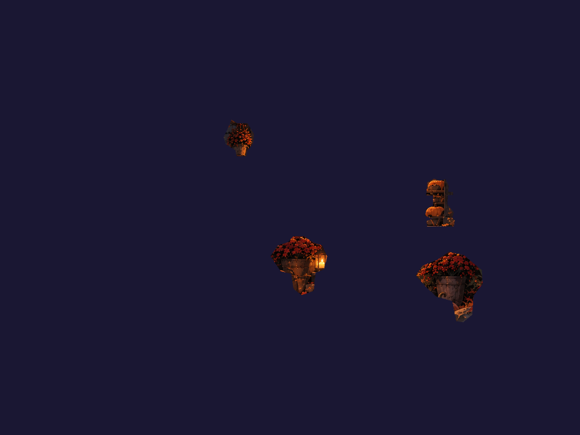

# Clean reusable objects: diagnosis and proposed first slice

September 12, 2026 · Research and triage only · Code audited: `77ba9f9482b54b7a3074ca48f43682fbdfa978a8`

The [delivery plan](../../architecture/REUSABLE-MODEL-SCENES-PLAN.md) defines the full expected outcomes, phased acceptance and later integration review. This report remains the research and evidence record.

**Recommendation:** construct the entire scene from reusable **models: editable components containing their own layers and, where useful, nested components**. Account for sky, clouds, distant woods, ground, architecture, leaf piles, props and characters. The seed supplies staging and visual identity; the final scene must stand without it. Add a small component authoring layer over the existing asset compiler, scene transactions, attachments, bindings and renderer. Start implementation with one layered lantern definition, two compatible variants and two scene instances. That engineering pilot does not reduce the whole-scene production scope.

The user's additional clarification is incorporated below: whole-seed inventory → library reuse or complete isolated art → model assembly and inspection → composition from instances → accepted models returned to the library. Composite transparency masks, silhouettes and tight bounds are derived outputs for a specified model pose/variant; editable layers remain the source.

Amberwatch contains a staged painting separated into scene-specific patches. Some patches still contain other objects. The lantern bodies and flames also lack the transform relationships needed to move as objects. Trimming four masks improved the pictures but did not produce reusable compound lanterns. Existing proofs expose these failures clearly.

The active project in `/Users/lb/.codex/worktrees/e31d/ambiance-studio` was inspected through read-only files. No project commands, jobs, generations, account changes or publication were performed there. This report and its evidence live in the isolated `8a59` worktree. [Evidence manifest][manifest] records source paths, hashes and copied proof artifacts; all 16 audited implementation/instruction files matched the active checkout. Working files were captured individually. The named v3/v4 proof snapshots, rather than the latest working scene or selected movie, bind the raster observations below.

## 1. What actually failed

The seed's identity survived restaging: an amber cottage, black cat on a railing, autumn framing, a cold valley and a path marked by candles. The error was treating paint cropped from that composition as sufficient object construction.

| Evidence | Finding and consequence |
| --- | --- |
| [Generation prompt set][prompts] | Generated a full 4:3 composition, two structure clean plates and an environment backing. Isolated generation was requested for the cat, leaves and flames. There was no request for complete isolated lantern, pumpkin, fence-section or tree models, or their internal parts. The first structure clean-plate request deliberately retained sconces; a later request removed them. |
| [prepare_art.py][prepare-script] | `part()` copies source RGB, replaces alpha with a polygon mask and crops its bounding box. Props come from `stage-composition-v1.png`; tree/fences come from the structure painting. This transfers all paint inside the mask, including neighboring objects and occluders. The script calls these “whole props,” but supplies no reconstructed hidden prop surfaces. |
| [assemble.py][assemble-script] | Lines 35–38 create three **unmasked rectangular sconce crops**. Compiler recipes allow opaque input. Lines 85–94 add flame instances after the body layers, without attachments or separate front frames. This is a body image plus foreground emission, not a rear/candle/flame/front assembly. |
| [v3 lantern isolation][lantern-v3] → [v4 lantern isolation][lantern-v4] | At 960×720, v3 visibly contains three orange wall rectangles and a pumpkin-colored sliver beside the lower-right lantern. The [v4 script][lighting-script] trims those four masks. The silhouettes improve; no internal model is created. The sconce replacement also uses the original lit crop, rather than the earlier dim derivative. An outside-contour trim does not remove baked illumination or background seen through glass. |
| [v4 lanterns hidden][lantern-hidden] and [v4 planters isolated][planters] | A lit lantern remains beside the left planter, around image coordinate (530,434). The planter isolation explicitly includes it. Thus hiding all eight declared fixtures and all eight flames still leaves lantern paint owned by another layer. This is an observed ownership failure, not merely a hypothetical risk. |
| [v4 tree isolation][tree] | A blue sky strip survives beside the trunk. The mask's `trunk = x < max(110, 280-y*.37)` branch bypasses the color rejection in that region. The tree is also a frame-edge fragment, not a complete tree available for arbitrary placement in a tree line. |
| [v4 pumpkin isolation][pumpkins] and [v4 fence isolation][fences] | The right pumpkin retains a foreground rock across its lower-right silhouette; other pumpkins retain leaf/ground fragments. Fence fragments terminate at the frame and include surrounding foliage/ground-shaped paint. Deliberately attached vines can belong to a fence model, but their ownership must be explicit; these crops do not establish independently reusable rails/posts or repaired concealed pumpkin paint. |
| [v4 scene snapshot][scene-v4] and [move diagnostic][move] | No scene depth groups exist. Lantern bodies, flames, pumpkin bodies and face emissions are independent root layers. In a copy held only in memory, moving `lantern-step-low` 80 scene pixels moves its flame **0 pixels**. The diagnostic establishes missing parenting; it is not a visual movement review. |
| [Production plan][production-plan] and [earlier observations][observations] | `whole-object-controls` is a structural `independent-control` expectation. The implementation checks named, disjoint layer references and a non-baked realization method. It does not require raster proof or determine what those pixels depict. The earlier observations recognize the v3 lantern failure and v4 trim, but do not identify the retained planter lantern, tree sky or pumpkin rock. |

The v4 scene has 69 layers, including 14 leaf instances and numerous receiver contributions. Its layer-plan “groups” are explanatory lists, not runtime ownership groups. Neither the count nor a family labeled `method: rig` provides a movable compound object. The renderer's proof report itself correctly says visual review was not performed; the separate agent observation is the artistic record being assessed.

The saved planter isolation makes the ownership failure directly reviewable: the left planter carries a lit lantern with it.



**Cause attribution:**

| Category | Diagnosis | Correction justified by this evidence |
| --- | --- | --- |
| Agent decisions — primary | Chose crop-and-mask preparation for objects needing hidden paint; accepted contaminated isolation pictures; left related flames and bodies unparented despite working sockets. | Produce and inspect a whole-object exemplar before multiplying it. Preserve failed observations until the corresponding paint and rig are corrected. |
| Creative/workflow ambiguity — contributing | Repository instructions already require complete ownership and removal proofs. However, repeated “extract,” reference-coordinate repair examples and scene-specific inventory families make source reconstruction the easiest demonstrated path. Amberwatch's brief is still an empty template; layout notes contain useful staging intent but no definition/variant/reuse contract. | State that the seed governs style, perspective and composition relationships; exact pixels are secondary. Choose a few object models and compatible variants before detailed scene assembly. Keep this decision in canonical plan/brief, not another competing census. |
| Generation limitations — real, not the demonstrated root cause | The cat returned painted checkerboard; native alpha on leaves/flames was discovered after generation. The record does **not** show an attempted isolated compound lantern failing. | Verify returned channels, silhouette, registration and missing paint. Do not infer that a generator cannot create a prop that was never requested. Multi-part consistency still needs an artistic pilot. |
| CLI affordances — contributing | The strongest guided path is source-backed separation and placement. No object definition/instance, subtree duplicate, variant or ownership-tree interface exists. Authors must expand parts, IDs, order, relationships and proofs manually. | Add component assembly/instancing and compact inspect/select/proof conveniences over existing primitives. |
| Validation — material gap | Structural independence can pass with contaminated RGB, absent parent relationships and family-level declarations. Low-level admission establishes integrity, not reusable-object fitness. | Add explicit component ownership/relationship checks and exact object-level observation evidence. Keep semantic pixel judgment as an observation, not an automatic promise. |

## 2. Existing capability: supported, awkward or missing

“Supported” means executable in the audited code. “Awkward” means primitives exist but require manual composition. “Missing” means a new contract or operation is needed.

| Capability | Status | Evidence and practical limit |
| --- | --- | --- |
| Immutable raster/atlas compilation and admission | **Supported** | [asset_tool.py][compiler] supports fixed/landmark/bottom-center registration, one sequence scale, padding, alpha bounds, hashes, cache integrity and protected catalog IDs. Empty cels fail; opaque cels need explicit opt-in. It cannot recognize wall/rock paint inside a valid alpha contour. |
| Alpha inspection, mapped crop/return and repairs | **Supported** | `asset preflight`, `edges`, `edge-repair`, `crop/return`, `region`, `trim-cels`; source maps and companion identities are available. Preflight is diagnostic, and bright/dark previewing is not a semantic pass. |
| Source placement and reparenting | **Supported** | [source placement][placement] maps verified source coordinates into ordinary fields/sockets. Native mode requires one-cel mappings; sprite mode needs explicit source size. `reparent --keep-world --at` preserves one pose, not the entire future trajectory; tracked/bound child transforms and unsupported shear/reflection fail. It does not require every new object to originate in scene pixels. |
| Compound preparation | **Awkward for reusable models** | [compound_preparation.py][compound] supports 1–16 flat parts, reconstructed per-part sources, shared backing/removal masks and up to four companions per part. Parts share the complete reference canvas; outputs are full-canvas registered images. Nested definitions, local tight frames, variants and independent instancing are absent. This is a separation workspace, not a component library. |
| Preparation placement/recovery | **Supported, source-bound** | [preparation_commands.py][prep-commands] compiles/admits checkpoints, replaces a mapped source plane with backing, and places parts in one scene transaction. Parts attach to that base; production motion is not copied. Scene `--dry-run` can still create asset/admission files. Resume verifies identities and rejects divergence. |
| Atomic scene edits/history | **Supported** | [transactions][transactions] and [scene bridge][bridge] validate complete batches, pin dependencies, use a project lock, expected scene hash and history. `add/set/replace/remove/order/group/socket/attach/reparent` are real operations. Asset creation/admission and scene commit are separate checkpoints. Direct writers still bypass the lock. |
| Nested transforms, sockets, cel timing | **Supported** | [engine.mjs][engine] inherits transform, visibility, opacity and camera depth once; static/per-cel sockets and absolute-time tracks work. An attached flame can paint behind its parent. Every runtime layer currently needs a raster asset; there is no non-paint transform node. |
| Foreground/midground/background organization | **Awkward** | Depth groups are one level, with offset, scale, pivot and parallax depth; they have no nested ownership, rotation or clip bounds. Members use canvas coordinates. Attachments supply nested transforms. `layers[]` supplies paint order independently of depth. |
| Lighting and receiver ownership | **Supported, explicitly authored** | [bindings][bindings] and finishing support source-driven channels, signals, receiver masks, anchored zones, shadow/reflection projections and receiver-clipped painted illumination. No physical light transport, unlit-paint reconstruction or automatic relocation of textured receiver patches. Amberwatch v4 uses pre-masked screen layers attached to receivers and cell bindings, with `finishing` removed. |
| Rig/look packages | **Awkward for object reuse** | [finishing.py][finish-code] exports finishing-referenced layers **and attachment ancestors**, not arbitrary owned descendants. Import needs existing explicit target IDs, matching canvas/fps/loop and exact rig art/socket identities; it restores source geometry and replaces finishing/bindings. It neither spawns an object nor merges multiple autonomous instance light systems. A scene without finishing cannot use this exporter as a general object pack. |
| Library discovery and versions | **Partial** | [assets.py][library-code] implements `library find/inspect` across bundled/current/selected-directory project catalogs; it does not automatically search the studio registry as project discovery does. Cross-project assets need deliberate local materialization/rebasing before admission. Immutable asset IDs exist; component-version pins, overrides, compatible swaps and update previews do not. |
| Inspect/tree/select/duplicate | **Awkward / missing conveniences** | `scene inspect --full`, `sample`, `timing` expose the information. The browser uses a flat layer selector. There is no CLI ownership tree, selector packet, component/subtree duplicate or variant operation. Raw asset swapping is `set.values.asset`, without an override compatibility contract. |
| Whole-object isolation/removal | **Supported rendering; awkward selection/evidence integration** | [rig-proof.mjs][rig-proof] supports explicit pose/hide overrides, effective hidden descendants, regions and comparisons. `part_ids` verifies inventory names, not ownership closure. Proof generation and review selection are manually authored. [Coverage][coverage] checks declarations, not pixel semantics. Its typed raster provider accepts `frame` and `views-proof`, not `rig-proof`; an existing rig-proof report cannot simply be registered as typed raster expectation evidence. |
| Bounds and clipping | **Partly supported** | Full-cell geometry and compiler alpha bounds exist; named views crop the stage. Receiver clipping exists for illumination. General nested object clip frames/masks and an aggregate object content/motion-bounds contract are **missing**. Transparent padding is not clipping; hiding behind a front frame uses ordinary paint order. |
| Composite model masks/silhouettes | **Missing** | Per-cel alpha is available, but no compiler output composites a model's nested layers by material role and derives pose/variant silhouettes. [Scene drawing][engine] fills the stage background; [finishing output][finish-render] forces final alpha to opaque. The finished beauty frame's alpha cannot supply an isolated model mask. |

Three existing Node suites and 30 Python tests passed during this audit: rig, tracks, source placement, asset compiler, compound preparation and finishing CLI. The compound tests exercise real raster proof/resume; finishing tests exercise rig identity and rebinding. [Check record][checks]. These confirm reusable foundations, not Amberwatch's artistic readiness. No shared implementation changed, so the entire studio test suite was not run.

## 3. Useful ideas from Figma and Photoshop

Official documentation was checked September 12, 2026. The right-hand column is a proposed adaptation, not a claim about Figma animation behavior.

| Documented behavior | Borrow for this studio |
| --- | --- |
| Figma separates a main component from linked reusable instances. [Component guide](https://help.figma.com/hc/en-us/articles/360038662654-Guide-to-components-in-Figma). | Separate definition identity from scene-instance identity; share art and assembly while keeping placement independent. |
| Components can contain nested instances, allowing the nested asset to be reused and swapped. [Nesting fundamentals](https://help.figma.com/hc/en-us/articles/39723486706455-Components-collection-Nesting-instances-fundamentals). | A lantern owns a candle subassembly; a tree owns selected branch assemblies. Reuse that same candle elsewhere without copying its definition. |
| Component properties expose intended changes, including visibility, instance swaps and variants; nested properties can surface at the top level. [Component properties](https://help.figma.com/hc/en-us/articles/5579474826519-Explore-component-properties). | Expose a small typed interface such as flame phase, lit appearance, candle type and front-frame variant. Inspection should not require traversing every internal layer. |
| Variants organize related components by unique combinations of named properties; not every possible combination must exist. Large sets can affect performance. [Variants](https://help.figma.com/hc/en-us/articles/360056440594-Create-and-use-variants). | Use a sparse set of compatible model variations. Do not create a variant for every flame cel or load every unused high-resolution variant into a scene. |
| Overrides have limits. Figma attempts preservation using matching layer names and, for variants, matching original properties; it does not preserve every structural edit. [Instance changes](https://help.figma.com/hc/en-us/articles/360039150733-Apply-changes-to-instances). | Use stable part/property IDs and explicit compatibility rules. Report retained, reset and conflicting overrides before a swap; never silently discard one because a label changed. |
| Frames can nest and clip overflowing children. Figma distinguishes geometric bounding boxes from rendered bounds that include effects. [Frames](https://help.figma.com/hc/en-us/articles/360041539473-Frames-in-Figma-Design), [node bounds](https://developers.figma.com/docs/plugins/api/node-properties/). | Separate ownership, coordinate frame, visible content bounds and an optional clipping boundary. Do not shrink a moving flame's registration frame to each cel's alpha bounds. |
| Published library changes become available for consuming files to review, accept or ignore. [Libraries](https://help.figma.com/hc/en-us/articles/360041051154-Guide-to-libraries-in-Figma). | Pin immutable versions in scenes and revisions; make updates explicit, diffable and scoped to selected instances. Immutable content-addressed pins are our proposed stronger delivery guarantee. |
| Photoshop preserves Smart Object source content; duplicate copies can be linked or independent. [Overview](https://helpx.adobe.com/ca/photoshop/desktop/create-manage-layers/smart-objects/smart-objects-overview-and-benefits.html), [duplicate semantics](https://helpx.adobe.com/ca/photoshop/desktop/create-manage-layers/smart-objects/duplicate-an-embedded-smart-object.html). | Distinguish “duplicate instance” from “fork definition.” Preserve editable layered sources even if runtime uses compiled PNGs. Rasterizing a whole model loses internal animation controls. |

Do not import auto-layout, automatic spatial reparenting, Figma's override restrictions, or automatic linked-file updates wholesale. Painted contact and occlusion are authored spatial relationships. Layers provide 2D/2.5D control, not unseen viewing angles, pathfinding or collision avoidance.

## 4. Proposed object/component contract

Use an immutable **definition**, an editable **instance**, and a resolved set of existing runtime layers. “Model” applies equally to a character, a leaf pile, a house or a sky surface. A house can contain window, door and lantern instances; a leaf pile can contain individual leaf instances. Each visible element has an explicit owner, without requiring every brush mark to become a separate layer. Keep production intent in the canonical plan; a definition describes reusable construction, not another film inventory.

| Concern | Proposed rule and implementation fit |
| --- | --- |
| Identity | Definition has a stable family ID, immutable version/content hash, stable part/property/socket IDs and explicit dependencies. Names are labels. Instance has a scene-unique ID; resolved layer IDs derive deterministically from instance ID plus nested part IDs, with collision checks. |
| Object-local geometry | Author in local pixels with a fixed design frame, pivot, part transforms and sockets. Convert local distances/sizes into existing canvas-normalized fields at instantiation, including track translations. Preserve compiler full-cell geometry and padding through mappings. Uniform instance scale/rotation are explicit; no silent stretch or independent per-part fit. |
| Bounds and masks | Store design frame and pivot; derive per-part/per-cel alpha bounds, composite model alpha, role-specific silhouettes/tight bounds and the intended motion envelope. Keep solid structure separate from glass, flame, smoke and glow. A crop is a storage optimization with a mapping. A clip is an intentional visibility operation. `clip: none` should be explicit for ordinary props. No automatic clipping at a tight content box. |
| Ownership and nesting | Each internal part has one owner. Definitions may reference version-pinned nested definitions with cycle rejection. A scene collection such as “midground tree line” organizes instances; it does not automatically attach them, clip them or change their paint order. |
| Attachment versus grouping | Ownership answers what to select/copy/hide. A transform parent says what follows movement; a socket names a physical mount. A lantern can be owned by the scene while attached to a fence hook. Nearby pumpkin/ground remain separate owners. Floor light is owned by its receiving surface. |
| Paint order and occlusion | Definition owns a local back-to-front sequence: rear housing → candle/flame → front frame/glass. Instance occupies a contiguous scene paint block by default, so a pumpkin can cover the whole lantern. Preserve separate parallax depth. Later allow explicitly exported rear/front slots for interleaving objects; do not silently flatten that artistic decision into depth sorting. |
| Properties | Expose typed, bounded properties mapped to existing layer channels/assets: visible source on/off, flame phase/cycle, compatible candle/frame choice, and selected appearance parameters. Properties carry defaults and validation. A hidden part and an unlit source are different controls. The existing engine's inherited opacity is multiplicative; do not promise offscreen group-opacity compositing. |
| Variants versus states | Variant selects compatible construction/art: frame style, proportions or pumpkin carving. Animation state selects cels/tracks within that construction. A flame's eight cels are not eight model variants. A changed viewing angle is new painted art with explicit compatibility, not a transform that invents it. |
| Overrides | Separate instance placement/mounting from property and allowed part overrides. Key overrides by stable IDs, not array position or display name. Swaps preserve placement, mounting, phase and compatible properties; incompatible sockets, ranges, bounds, timing or target parts produce a reviewable conflict. Structural edits fork a definition or explicitly release instance management. |
| Library and version updates | The model library preserves editable layered sources, assembly recipes, provenance, versions and accepted-review evidence. Runtime-only distributions may omit rebuild sources, but the canonical reusable model retains them. Instantiation locks definition and nested/art hashes. Import verifies and locally materializes the dependency closure; no live reference to another mutable worktree. An update previews affected instances, properties, receiver relationships and evidence. Missing mappings fail atomically. Saved revisions/editions remain pinned to their prior resolved art. |
| Emission and receivers | Definition owns fixture-local candle, flame, glass and emission art plus named emitter outputs. Scene owns ground/wall masks, shadows and reflected/illuminated paint. Per-instance IDs namespace signals/bindings; a scene relationship binds an emitter to explicit receivers. Hiding the root makes its attached source inactive and uses receiver `off: 0`. Moving the emitter must update a supported anchored zone/bounded receiver mapping or report that the receiver placement needs new authoring. It must not drag copied ground paint along with the lantern. |

**Derived edge products:** resolve nested parts in the model's fixed local frame at a named variant, pose/time and override set. Composite their transformed alpha onto transparency using the evaluated visibility, opacity and supported masks. Save assembled visual alpha plus separate coverage masks for explicitly assigned roles: solid structure, glass, flame, smoke and glow. Material roles are authored; low alpha alone does not identify glass. External receiver lighting remains outside the model's silhouette.

Retain soft alpha and holes. Derive contours and tight bounds with recorded thresholds; an optional all-effects extent must not replace the solid-structure boundary. These are image-space coverage products, not inferred physical collision geometry. Record definition/nested-art hashes, sampled state, resolution, thresholds and crop-to-local mapping. Any dependent edit makes the products stale. A selected-pose mask describes that pose; a sampled motion envelope must identify its samples and cannot claim unobserved coverage. Compilation preserves the model's editable hierarchy and stable pivot, even if its derived preview or mask is a single image. This needs a transparent model-output adapter over the existing evaluator/raster primitives; it is distinct from later runtime clipping support.

An illustrative ownership tree (not current scene syntax):

```text
scene
├─ background collection: sky, cloud, valley and complete tree instances
├─ house model: walls, roof, window and door instances
├─ midground collection
│  ├─ lantern A → pinned iron-lantern definition
│  │  ├─ rear housing / stable transform root
│  │  ├─ candle → nested candle definition
│  │  │  ├─ wax + wick
│  │  │  └─ flame cels, attached at wick
│  │  └─ front frame + glass
│  └─ lantern B → same definition, different phase/variant
├─ foreground collection: independent pumpkin and leaf-pile models
└─ stone surface → receiver paint driven by lantern A's emitter
```

**Smallest implementation shape:** use the stable rear-housing layer as the lantern's transform root and a trunk/root part for the tree. Both retain a fixed design frame across compatible variants. Reuse nested attachments to carry children. There is no need to fake an invisible root using an empty atlas cel—the compiler rejects empty cels. A general non-paint transform node can follow when a model needs a root independent of every drawable part.

Store instance metadata and the resolved part-ID map in an optional, versioned scene extension, committed together with ordinary layers through the existing scene transaction. Definition + instance overrides are authoritative; resolved layers are their materialized render representation, not a second freely editable source. Component commands regenerate the affected representation. Raw CLI/browser edits to managed fields must either become validated overrides or report drift and require explicit detachment/forking. Do not silently overwrite them on the next swap.

Keep the resolver shared by CLI and browser. Extend typed dependency discovery, scene validation and revision/package capture to pin definitions and nested references. Rendering should continue through `compileScene/drawScene`; loading an old scene must retain its current behavior. Reuse must explicitly map local-pixel translations to each scene's dimensions and bind timing to its existing clock. Reject non-dividing cycles or incompatible authored track duration unless a retiming choice is supplied; do not silently inherit the source film's canvas/clock. General nested clipping, arbitrary transform groups and interleaved paint slots are later extensions. For the first lantern, pre-registered flame alpha and its front frame supply the required occlusion without a renderer change.

## 5. Production recipe usable with existing primitives

The production sequence covers the whole scene:

1. **Inventory the entire seed.** In the canonical plan, account for every visible model, internal parts, overlaps, nested instances and hidden surfaces needed for repositioning. Include sky, clouds, distant woods, ground, architecture, leaf piles, props and characters. Mark chosen creative requirements `required: true`; plan both portrait and landscape staging and intended actions before cutting art.
2. **Check the library.** Inspect compatible models and their accepted versions, style, perspective, scale/detail and exposed controls. Reuse them where they fit. Prepare missing models as complete, isolated artwork, including concealed paint and clean backing. Preserve source returns and provenance. This research task authorizes no generation.
3. **Assemble and inspect each model.** Establish local coordinates, ownership, attachments, variants and exposed animation controls. Compile registered parts and inspect assembled rest/extreme poses, role masks and contours once supported. Opaque sky/ground surfaces are valid models; props need clean transparency. A source crop is usable only when it has clean ownership and sufficient hidden paint.
4. **Compose from instances.** Use the seed as the staging reference, selecting model variants and mounting/ordering instances explicitly. Review contacts, overlaps, receiver effects and motion in both compositions. Keep the seed outside production rendering.
5. **Return accepted models to the library.** Preserve editable sources, nested dependency closure, assembly recipes, versions, provenance and exact review evidence. Separate compiled/admitted status from artistic acceptance. Acceptance records bind the reviewed version and its intended use; reuse still requires fit in the new scene. Each film should contribute reusable work.

Existing asset and scene primitives support a manually authored version of this sequence. Model definitions, composite-mask outputs and automated instance/library operations below remain proposed capabilities.

| Model | Art and assembly recipe | Required inspection |
| --- | --- | --- |
| **Compound lantern** | Design a complete iron lantern with handle, base, rear housing, candle/wick, flame sequence, front bars/rim and separate glass treatment where useful. Paint the candle and rear interior behind front bars across the flame's sweep. Reconstruct the complete base even where the seed's rock covers it. Use the same local camera, registration frame and pivot for every part. Attach candle to housing and flame to wick; attach front frame to housing, but paint it after the flame. Create two coherent frame variants sharing mount, wick, design frame and exposed properties. | Alpha on light/dark backgrounds, through-glass ownership, complete silhouette, off/dim appearance, flame extremes behind bars, base/handle contacts, no wall or rock fragments. Show two placements against different backing to expose baked contextual paint. Keep external shadows/light contributions on receivers. |
| **Pumpkin** | Paint a complete shell/stem silhouette free of rock, planter and ground. Where light or internal movement needs it, use rear cavity/interior, candle/flame, carved front shell and rim/face emission. Keep an unlit/dim shell available; optional lid gets its own hinge only if the action requires it. Choose a few compatible shape/carving variants. Paint concealed shell behind expected foreground rocks; place those rocks independently. | Shell remains complete with rock/planter hidden; face lighting stays within intended openings; no old flame remains beneath new emission; fixed stem/base contact; surrounding leaves and shadows have explicit ownership. Lighting states do not claim changing shell drawings. |
| **Reusable trees** | Create a few complete trunks/root contacts and crowns with compatible perspective/style, plus optional separate near branch/canopy masses. Paint bark behind moving branches and foliage behind their sweep. Use trunk and branch sockets only where needed. Reuse instances with authored scale, phase, spacing and sparse variants in background/midground/foreground sets; preserve coherent silhouette families and atmospheric treatment. A frame-edge branch fragment remains a labeled framing asset, not a whole tree. | Clear alpha in canopy gaps, no retained sky wedges, complete root/crown where the model claims them, branch contacts at extremes, no missing background when one tree moves/hides. Inspect repeated patterns and ground contact in the assembled tree line. |

Prepare clean environment models: sky/valley behind trees, ground behind props, wall behind sconces, and fence sections with deliberate endpoints/join sockets. Paint needs to continue behind removed foreground objects. Each surface retains its identity and editable structure; a catch-all background plate must not absorb separately inventoried clouds, woods or architecture. Fence rails/posts may own deliberately attached vine models. Leaf-pile models own their leaves; painted ground texture belongs to the ground. Preserve these ownership distinctions when preparing backing.

Run preflight, register at shared scale, compile/admit versioned assets, and author the compound with `scene apply`. Use `asset prepare` when there really is a shared reference/backing separation problem; its full-reference recipe should not be a mandatory wrapper for already isolated art. Inspect all alpha edges and intended rest/extremes, then normal-speed motion at intended display size. Source prompts, small crops and successful compiles do not establish style consistency or sufficient detail.

## 6. CLI-first workflow

Existing commands below are real. Proposed names and flags are interface sketches for review, not runnable capabilities. `component` means a reusable definition; `object` means a scene instance.

| Operation | Existing route now | Proposed convenience |
| --- | --- | --- |
| Inspect/select | `scene inspect --full`, `scene sample --time`, `scene timing --layer`; select IDs from JSON | `scene tree`; `object inspect ID`; `scene select --owner ID --descendants` returning IDs, hashes, bounds, parents, assets, properties and proof paths. Selection is a saved/resolved packet, not hidden CLI state. |
| Generate/import clean art | External authorized generation/import; `asset request record/reconcile/inspect`; `asset preflight`, `build/inspect/proof/admit` | `component init FILE` creates a local-frame parts/provenance checklist and missing-art packet. No implied provider submission. `component import PACKAGE` materializes a verified local dependency closure. |
| Assemble definition | Hand-author a batch of `add/socket/attach/order` and retain a recipe | `component build RECIPE --out DIR` validates stable parts, local geometry, variant interface and artifact identities using existing packs; emits composite alpha, role masks, contours and bounds for recipe-specified poses/variants. |
| Instantiate/duplicate | `scene add` instantiates one raster; a hand-authored `scene apply` can create a compound with unique IDs | `object instantiate PACKAGE --id ID`; `object duplicate ID --id NEW`. Namespace internal layers, sockets, signals and bindings; leave external receiver adoption explicit. |
| Group/reparent/move | Batch `group/set`; `scene attach`; `scene reparent … --keep-world --at`; `scene set` on a correctly rigged root | `object group` creates an ownership collection; `object attach/reparent` declares mounting; `object move` changes the root. Grouping alone must not change geometry/depth/order. |
| Override/swap | Batch `set.values.asset`, tracks and bindings, authored manually | `object override ID --file FILE`; `object variant ID --set frame=arched`; explicit update/compatibility diff and reset operation. |
| Prove isolation/removal | `render rig-proof RECIPE --out DIR`, `render views-proof`, `render frame`, `asset edges` | `object proof ID --out DIR` expands ownership and source/receiver dependencies into existing proof recipes; returns effective hidden IDs plus exact raster/contact/playback paths. |
| Return accepted model to library | Preserve source/assembly/evidence files and admit versioned raster packs; `library find/inspect` discovers assets | A model catalog record joins the pinned editable definition/dependencies with review evidence and reuse constraints. Admission and acceptance remain separate records; general package transfer/update commands can follow. |

**One batch endpoint first:** proposed `object apply FILE --dry-run --expect-sha256 HASH`, with instantiate, duplicate, move, property/variant change and collection membership operations. Thin convenience commands should use it. A batch validates the complete candidate, reports namespaced IDs and conflicts, and writes instance metadata, layers and relationships in one existing scene transaction. It must preserve unrelated scene entries.

The first slice can consume already admitted local packs, with a local model catalog record preserving the editable definition, dependency identities and review evidence. Returning accepted models to that library is part of the workflow from the start. General component-package transfer, registry-wide discovery and bulk cross-project upgrades can follow; they need not block the two-lantern demonstration.

Separate immutable build/import from scene editing. A build journal can reuse completed packs by hash after interruption; a scene batch should never expose half an instance. Store an explicit operation ID/input hash and result identity so retry verifies a completed commit rather than duplicating it. Changed inputs or scene divergence require a rebase, not a blind replay. Extend the preparation journal pattern; do not pretend that asset creation, catalog admission and scene replacement are one existing filesystem transaction.

Proposed pilot sequence: inventory seed → inspect library → build/import isolated definitions and derived masks → inspect model tree and missing art → batch two lantern instances, pumpkin and tree instances → inspect/move/swap → object proof → actual raster and playback observation → record accepted models in the library. Full production repeats this across the complete inventory. Browser exposes the same resolved tree, selections, property controls, previews and change packets. Preserve the current explicit-save boundary; do not introduce a separate GUI-only authoring model.

Proof integration needs one bounded adapter: a typed object-proof receipt identifying the definition/instance, owned parts, actual selected/hidden layers, overrides, view envelopes and hashed raster outputs. Reuse the rig/view renderers and existing observation machinery; extend their evidence validator rather than passing a `rig-proof` report off as a currently supported raster receipt. Ownership observations must identify the exact isolate/removal samples, and motion observations still need actual normal-speed viewing.

## 7. First-slice acceptance and priority

Use a new isolated fixture/pilot project, never the live Amberwatch job. Complete the following through CLI-saved inputs. Geometric art can establish engineering behavior; a small painted pilot is separately necessary to establish that agents choose and produce clean assets.

| Acceptance experiment | Evidence and failure condition |
| --- | --- |
| Build one lantern and instantiate it twice | One pinned definition/art closure, distinct instance/part IDs, independent transforms and phases. Nested candle/flame children resolve identically in local coordinates. Re-running the same committed operation does not duplicate parts. |
| Compile composite masks and bounds | At named poses/variants, compare assembled alpha with actual isolated part rendering. Solid contours preserve openings and exclude glass/flame/smoke/glow coverage; separate role masks retain soft edges. Tight crops map back to the fixed pivot without shifting parts. Editing a nested part invalidates the affected derived products. A beauty frame's opaque alpha is a failure. |
| Animate flame behind front frame | All actual flame cels plus extrema appear behind bars/rim in raster output; normal-speed loop and join reviewed. Random seeks give the same states. No old painted flame supplies a duplicate. |
| Put one lantern behind an independent pumpkin | Whole lantern paint block remains behind the pumpkin; the second lantern is independently ordered. Hide the pumpkin to expose a complete lantern, then hide the lantern to expose complete background. No depth-number sorting or collision avoidance claim. |
| Move and hide the whole lantern | Root movement carries candle, flame and front frame. At the same sampled time, unrelated geometry/paint and the other instance remain unchanged. Difference pixels are confined to old/new object footprints and declared receiver effects. Hiding all owned parts leaves no lantern in planters, ground or backing. |
| Preserve contact and receiver ownership | Source-local light follows the fixture. Ground/wall paint stays on its receiver, with explicitly updated bounded influence. Source hidden/off disables its receiver contribution while other lights remain. Out-of-envelope moves identify new receiver/backing work instead of silently accepting stale light placement. |
| Swap compatible variant | Frame art changes while position, mount, flame phase and allowed appearance overrides remain. The report lists retained/reset/conflicting fields. An incompatible wick socket, removed part or changed cel table rejects the entire batch; definition rename alone does not lose overrides. |
| Reuse tree components | Instantiate a small tree line from a few pinned models. Move/hide one complete tree without carrying sky or neighboring paint. Inspect canopy holes, root contact, overlaps and repetition; no arbitrary minimum layer count. |
| Verify persistence/version behavior | Wrong hash, duplicate ID, cycle, late invalid operation and interrupted build produce recoverable errors. Unrelated bindings survive instantiation. Updating a definition leaves old scene/revision art intact until explicitly adopted. Managed-layer drift is surfaced. |
| Return and reuse the accepted model | The local model catalog preserves editable sources, nested definitions, versions, provenance and exact acceptance evidence. Reconstruct an instance from that catalog record in a clean fixture, without depending on the pilot scene or another worktree's mutable files. |
| Inspect the actual images | Save component isolation on contrasting backgrounds, production-only composition, object-hidden/reverse-hidden views, internal rest/extremes and normal-speed paired portrait/landscape playback. Inspect a native-detail crop plus each intended full composition. Record observer, display size, time/cels, findings and exact hashes. Geometry/alpha statistics remain separate from the observed verdict. |

**Full-scene production acceptance is a separate gate.** Remove the seed entirely from the render inputs and reconstruct the scene from cataloged model instances. Every visible contribution must resolve to an inventoried model/part or an explicit effect on a receiving model; a renamed seed or unaccounted fallback painting fails. Move or hide each component through its intended placement/action range: it must carry no unrelated paint, and the surfaces revealed behind it must be finished. Inspect internal nested components as well as top-level models. Record both production-only compositions and actual normal-speed motion; run `plan check --require-complete` before claiming the film's scope complete. Confirm that accepted models and editable sources have returned to the library. The lantern pilot demonstrates the construction mechanism; it cannot satisfy this whole-scene gate.

Priority follows demonstrated failures:

1. **P0 — workflow corrections usable now.** Inventory the whole seed, including environment models; search the library and choose clean whole-object models before scene slicing. Record complete silhouette, hidden paint, variant/reuse intent and backing in existing plan/brief fields. Preserve accepted editable assemblies for library reuse. Use the current sockets to attach flame/candle/front art. Review every object's isolation and removal across *all contributing layers*, including planters and overlays. Record exact rig-proof observations in the existing review notes/criteria, retaining failed extraction work; use currently supported frame/views/movie receipts where typed plan evidence is required. Do not relabel structural checks as visual verification. An agent pilot must catch the retained planter lantern, pumpkin rock and tree sky. This would prevent the demonstrated art/review failures without a renderer change.
2. **P1 — compact CLI affordances and definition/instance adapter.** Add tree/selection, local-frame definition validation, local model catalog records, one atomic object batch endpoint, duplicate/compatible swap, derived composite/role masks and bounds, ownership-derived proof recipes and their typed evidence adapter. Implement stable IDs, pins and override compatibility only to the extent needed by the lantern/tree pilot. Test against existing scene/asset/rig logic and negative transaction cases; verify native raster overlaps and transparent mask outputs. This prevents unattached flames, incomplete duplicate operations and manually omitted proof parts. It makes reusable construction easier than source-specific scripting.
3. **P2 — extensions after that pilot.** Add general non-paint roots, nested transform collections, runtime clip frames/masks, interleaved paint slots and richer library version/update tools only when a tested object cannot be represented faithfully. Keep resource limits measured by texture/decode/render cost and content structure; do not raise the preparation's 16-part bound as a substitute for nested models or impose a scene layer quota. General provider queues and new lighting simulation are outside this evidence-driven scope.

For implementation, run `./ambiance test` plus the existing compiler, rig, track, source-placement, compound-preparation, binding, finishing, revision and proof tests affected by the changes. Add focused tests for instance expansion/override persistence/dependency closure and CLI replay, then inspect the actual edited fixture in the browser because tree/preview behavior changes. Run the package audit if dependency packaging changes. No synthetic check can certify a clean painted model; the independent artistic pilot is the behavioral test.

**Proposed implementation scope for review:** one immutable local-frame component contract and local model catalog record; one scene instance/override extension; one shared resolver and atomic object batch endpoint; derived composite/role masks, silhouettes and bounds; compact tree/inspect/proof commands and a typed proof adapter; a nested layered lantern with two compatible frame variants instantiated twice, an independent pumpkin occluder, and reusable tree instances. Reuse current raster primitives, source registration, sockets, bindings, history and evidence. Defer generic clipping and transform-node changes unless the slice demonstrates a concrete need. Whole-scene reconstruction and library return remain the production target. This report proposes that scope; it does not change the live film or implement it.

[manifest]: evidence/manifest.json
[checks]: evidence/checks.json
[move]: evidence/move-diagnostic.json
[prepare-script]: evidence/amberwatch/scripts/prepare_art.py#L39
[assemble-script]: evidence/amberwatch/scripts/assemble.py#L35
[lighting-script]: evidence/amberwatch/scripts/painted_lighting.py#L23
[prompts]: evidence/amberwatch/plans/generation/complete-prompt-set.json
[production-plan]: evidence/amberwatch/plans/production-plan.json#L1109
[observations]: evidence/amberwatch/reviews/production-observations-v4.md
[scene-v4]: evidence/whole-object-v4/scene.snapshot.json
[lantern-v3]: evidence/whole-object-v3/samples/lanterns-isolated/context.png
[lantern-v4]: evidence/whole-object-v4/samples/lanterns-isolated/context.png
[lantern-hidden]: evidence/whole-object-v4/samples/lanterns-hidden/context.png
[planters]: evidence/whole-object-v4/samples/planters-isolated/context.png
[tree]: evidence/whole-object-v4/samples/tree-isolated/context.png
[pumpkins]: evidence/whole-object-v4/samples/pumpkins-isolated/context.png
[fences]: evidence/whole-object-v4/samples/fences-isolated/context.png
[compiler]: https://github.com/lbliii/ambiance-studio/blob/77ba9f9482b54b7a3074ca48f43682fbdfa978a8/tools/asset_tool.py#L252
[placement]: https://github.com/lbliii/ambiance-studio/blob/77ba9f9482b54b7a3074ca48f43682fbdfa978a8/docs/SOURCE-PLACEMENT.md
[compound]: https://github.com/lbliii/ambiance-studio/blob/77ba9f9482b54b7a3074ca48f43682fbdfa978a8/ambiance_studio/compound_preparation.py#L24
[prep-commands]: https://github.com/lbliii/ambiance-studio/blob/77ba9f9482b54b7a3074ca48f43682fbdfa978a8/ambiance_studio/preparation_commands.py#L129
[transactions]: https://github.com/lbliii/ambiance-studio/blob/77ba9f9482b54b7a3074ca48f43682fbdfa978a8/ambiance_studio/scene_transactions.py#L19
[bridge]: https://github.com/lbliii/ambiance-studio/blob/77ba9f9482b54b7a3074ca48f43682fbdfa978a8/tools/scene-command.mjs#L22
[engine]: https://github.com/lbliii/ambiance-studio/blob/77ba9f9482b54b7a3074ca48f43682fbdfa978a8/editor/engine.mjs#L87
[bindings]: https://github.com/lbliii/ambiance-studio/blob/77ba9f9482b54b7a3074ca48f43682fbdfa978a8/docs/BINDINGS.md
[finish-code]: https://github.com/lbliii/ambiance-studio/blob/77ba9f9482b54b7a3074ca48f43682fbdfa978a8/ambiance_studio/finishing.py#L88
[finish-render]: https://github.com/lbliii/ambiance-studio/blob/77ba9f9482b54b7a3074ca48f43682fbdfa978a8/editor/finishing.mjs#L225
[library-code]: https://github.com/lbliii/ambiance-studio/blob/77ba9f9482b54b7a3074ca48f43682fbdfa978a8/ambiance_studio/assets.py#L101
[rig-proof]: https://github.com/lbliii/ambiance-studio/blob/77ba9f9482b54b7a3074ca48f43682fbdfa978a8/tools/rig-proof.mjs#L11
[coverage]: https://github.com/lbliii/ambiance-studio/blob/77ba9f9482b54b7a3074ca48f43682fbdfa978a8/ambiance_studio/production_coverage.py#L471
