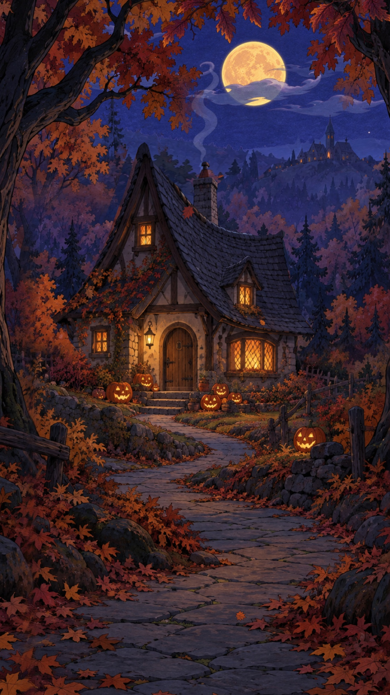

# The Last Lantern — reference case

This is the project that established the studio's initial style and workflow. Its sources and finished files are preserved in the optional production-reference archive. The everyday kit contains the normalized art, six sprite atlases, and a placement scene.

## What made it work

The film presents a warm cottage among pumpkins and autumn trees, with a moon, moving cloud layers, distant hills and a glowing town. Foreground framing and depth-dependent movement make the image feel spatial. Actual painted/composited frame sequences give clouds, smoke, flames, curtains, and windows changing detail.

The picture loops every 16 seconds at 1080 × 1920 and 30 fps. The main soundtrack runs 48 seconds over three picture repetitions. Its emotional idea is “A light is still on for you”: music draws attention toward the cottage, a muffled hearth suggests shelter, and a distant bell expands the world.

## Reusable decisions

- Separate the clean vista from the house; the original painting cannot remain unchanged behind a moving cutout.
- Give cottage, smoke origin, and ground a shared transform.
- Keep stable architecture while animating windows and internal shadows.
- Use an unlit/dimmed town base so light cels have visible range.
- Register common scale/baseline across generated frames; clean matte residue and neighboring fragments.
- Combine low-rate cels with smooth periodic depth movement.
- Give distinctive audio events a longer master period than the short picture loop.
- Keep picture and audio exports separate so sound revisions can reuse encoded picture.

## Actual art sources

Cloud, smoke, and flame sequences began as generated painted sheets. Cottage/window cels combined fixed architecture, generated flame poses, and authored curtain/shadow detail. Town light cels isolated and varied illumination. The project did not independently regenerate every building frame or hand-draw every generated source.

The bundled atlas layouts are: clouds 8 cels, smoke 12, flame study 8, windows 12, cottage 12, and town lights 16. The engine uses the catalog's exact cell dimensions and cycle metadata.

## Evidence retained

The original production records report 480 frames for the 16-second picture, matching state at zero and exactly 16 seconds, and complete decoded final videos. The 48-second scored export has 1,440 presented frames. The audio records include source hashes, exact master durations, levels, peaks, mono checks, and encoded-audio comparison.

The user expressed strong approval of the final result. A physical phone-speaker listening check was not recorded. This case study therefore does **not** retroactively mark every new studio gate passed. Historical evidence is retained as evidence of its stated scope, not a fresh certification.

## Known technical debt

The native preparation and renderer sources contain scene-specific paths, coordinates, masks, and effects. The browser prototype ports placement and cels but omits the full film's mist, glows, procedural leaves, and motes. Final export and the audio mixer are not integrated into it.

Inspection during packaging found that the legacy `render-v2.m` verification routine constructs paths under `outputs/` instead of `outputs/v2/`. Use the later `media.m verify` helper with an explicit target path when checking the v2/final film; do not treat that legacy routine as proof of which file was inspected. The reference archive preserves the historical source and calls out this limitation.

The original music was retrieved as compressed AAC in an MP4 container. The edited 24-bit WAV masters preserve the mix, not information absent from that source. Generation cost and total production time were not comprehensively logged.

## Use this as a regression reference

When extending the shared engine, compare representative frames, attachment behavior, camera extremes, cel timing, and the loop against the finished film. Record any intended differences. Then build a different scene with the same engine to test whether the abstractions transfer.
